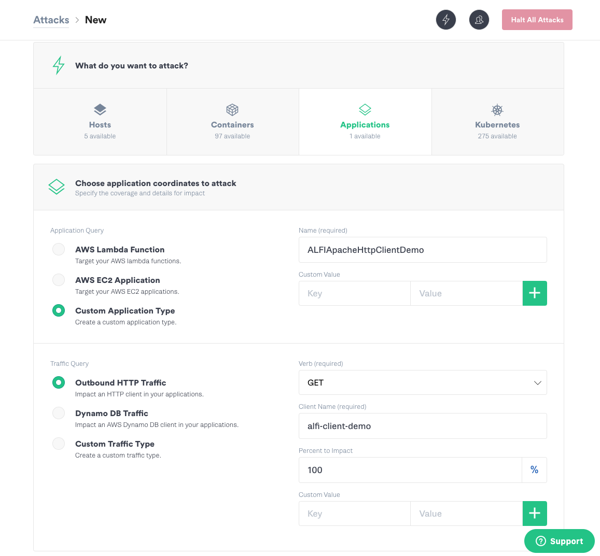
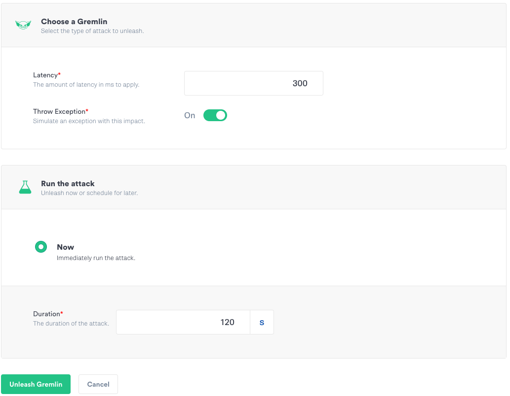

# alfi-apache-http-client
A simple example of Gremlin's ALFI Apache HTTP Client support

## Setup

1. Set the following environment variables:

    | Key | Value|
    | ---- | ---- |
    | GREMLIN_ALFI_ENABLED | true |
    | GREMLIN_TEAM_CERTIFICATE_OR_FILE | file:///path/to/.gremlin/cert.pem |
    | GREMLIN_TEAM_PRIVATE_KEY_OR_FILE | file:///path/to/.gremlin/priv.pem |
    | GREMLIN_TEAM_ID | < Your team ID > |    


2. Launch the alfi-apache-http-client application locally from the root of this project.

    `./mvnw spring-boot:run`        

## Usage

1. Test the application (locally) visiting http://localhost:8080 in your browser. You should see the home page for https://www.gremlin.com.

2. Setup an ALFI Attack in Gremlin like this:



3. Set the Duration then click the "Unleash Gremlin" button



4. Test the application (locally) visiting http://localhost:8080 in your browser. 
    
You should see a generic error page in addition to a stack trace similar to the following: 

```text
2020-06-08 15:18:04.774  INFO 68203 --- [nio-8080-exec-6] c.e.a.controller.MainController          : Executing GET request to https://www.gremlin.com/...
2020-06-08 15:18:05.345  INFO 68203 --- [nio-8080-exec-6] .h.c.GremlinApacheHttpRequestInterceptor : Gremlin will inject failure (fail=true, latency=300ms) into Apache HttpClient (alfi-client-demo)
org.apache.http.client.ClientProtocolException
	at org.apache.http.impl.client.InternalHttpClient.doExecute(InternalHttpClient.java:187)
	at org.apache.http.impl.client.CloseableHttpClient.execute(CloseableHttpClient.java:83)
	at org.apache.http.impl.client.CloseableHttpClient.execute(CloseableHttpClient.java:108)
	at com.example.alfiapachehttpclient.controller.MainController.hello(MainController.java:41)
	at java.base/jdk.internal.reflect.NativeMethodAccessorImpl.invoke0(Native Method)
	at java.base/jdk.internal.reflect.NativeMethodAccessorImpl.invoke(NativeMethodAccessorImpl.java:62)
	at java.base/jdk.internal.reflect.DelegatingMethodAccessorImpl.invoke(DelegatingMethodAccessorImpl.java:43)
	at java.base/java.lang.reflect.Method.invoke(Method.java:566)
	at org.springframework.web.method.support.InvocableHandlerMethod.doInvoke(InvocableHandlerMethod.java:190)
	at org.springframework.web.method.support.InvocableHandlerMethod.invokeForRequest(InvocableHandlerMethod.java:138)
	at org.springframework.web.servlet.mvc.method.annotation.ServletInvocableHandlerMethod.invokeAndHandle(ServletInvocableHandlerMethod.java:105)
	at org.springframework.web.servlet.mvc.method.annotation.RequestMappingHandlerAdapter.invokeHandlerMethod(RequestMappingHandlerAdapter.java:879)
	at org.springframework.web.servlet.mvc.method.annotation.RequestMappingHandlerAdapter.handleInternal(RequestMappingHandlerAdapter.java:793)
	at org.springframework.web.servlet.mvc.method.AbstractHandlerMethodAdapter.handle(AbstractHandlerMethodAdapter.java:87)
	at org.springframework.web.servlet.DispatcherServlet.doDispatch(DispatcherServlet.java:1040)
	at org.springframework.web.servlet.DispatcherServlet.doService(DispatcherServlet.java:943)
	at org.springframework.web.servlet.FrameworkServlet.processRequest(FrameworkServlet.java:1006)
	at org.springframework.web.servlet.FrameworkServlet.doGet(FrameworkServlet.java:898)
	at javax.servlet.http.HttpServlet.service(HttpServlet.java:634)
	at org.springframework.web.servlet.FrameworkServlet.service(FrameworkServlet.java:883)
	at javax.servlet.http.HttpServlet.service(HttpServlet.java:741)
	at org.apache.catalina.core.ApplicationFilterChain.internalDoFilter(ApplicationFilterChain.java:231)
	at org.apache.catalina.core.ApplicationFilterChain.doFilter(ApplicationFilterChain.java:166)
	at org.apache.tomcat.websocket.server.WsFilter.doFilter(WsFilter.java:53)
	at org.apache.catalina.core.ApplicationFilterChain.internalDoFilter(ApplicationFilterChain.java:193)
	at org.apache.catalina.core.ApplicationFilterChain.doFilter(ApplicationFilterChain.java:166)
	at org.springframework.web.filter.RequestContextFilter.doFilterInternal(RequestContextFilter.java:100)
	at org.springframework.web.filter.OncePerRequestFilter.doFilter(OncePerRequestFilter.java:119)
	at org.apache.catalina.core.ApplicationFilterChain.internalDoFilter(ApplicationFilterChain.java:193)
	at org.apache.catalina.core.ApplicationFilterChain.doFilter(ApplicationFilterChain.java:166)
	at org.springframework.web.filter.FormContentFilter.doFilterInternal(FormContentFilter.java:93)
	at org.springframework.web.filter.OncePerRequestFilter.doFilter(OncePerRequestFilter.java:119)
	at org.apache.catalina.core.ApplicationFilterChain.internalDoFilter(ApplicationFilterChain.java:193)
	at org.apache.catalina.core.ApplicationFilterChain.doFilter(ApplicationFilterChain.java:166)
	at org.springframework.web.filter.CharacterEncodingFilter.doFilterInternal(CharacterEncodingFilter.java:201)
	at org.springframework.web.filter.OncePerRequestFilter.doFilter(OncePerRequestFilter.java:119)
	at org.apache.catalina.core.ApplicationFilterChain.internalDoFilter(ApplicationFilterChain.java:193)
	at org.apache.catalina.core.ApplicationFilterChain.doFilter(ApplicationFilterChain.java:166)
	at org.apache.catalina.core.StandardWrapperValve.invoke(StandardWrapperValve.java:202)
	at org.apache.catalina.core.StandardContextValve.invoke(StandardContextValve.java:96)
	at org.apache.catalina.authenticator.AuthenticatorBase.invoke(AuthenticatorBase.java:541)
	at org.apache.catalina.core.StandardHostValve.invoke(StandardHostValve.java:139)
	at org.apache.catalina.valves.ErrorReportValve.invoke(ErrorReportValve.java:92)
	at org.apache.catalina.core.StandardEngineValve.invoke(StandardEngineValve.java:74)
	at org.apache.catalina.connector.CoyoteAdapter.service(CoyoteAdapter.java:343)
	at org.apache.coyote.http11.Http11Processor.service(Http11Processor.java:373)
	at org.apache.coyote.AbstractProcessorLight.process(AbstractProcessorLight.java:65)
	at org.apache.coyote.AbstractProtocol$ConnectionHandler.process(AbstractProtocol.java:868)
	at org.apache.tomcat.util.net.NioEndpoint$SocketProcessor.doRun(NioEndpoint.java:1590)
	at org.apache.tomcat.util.net.SocketProcessorBase.run(SocketProcessorBase.java:49)
	at java.base/java.util.concurrent.ThreadPoolExecutor.runWorker(ThreadPoolExecutor.java:1128)
	at java.base/java.util.concurrent.ThreadPoolExecutor$Worker.run(ThreadPoolExecutor.java:628)
	at org.apache.tomcat.util.threads.TaskThread$WrappingRunnable.run(TaskThread.java:61)
	at java.base/java.lang.Thread.run(Thread.java:834)
Caused by: org.apache.http.HttpException: Fault injected by Gremlin
	at com.gremlin.http.client.GremlinApacheHttpRequestInterceptor.process(GremlinApacheHttpRequestInterceptor.java:112)
	at org.apache.http.protocol.ImmutableHttpProcessor.process(ImmutableHttpProcessor.java:133)
	at org.apache.http.impl.execchain.ProtocolExec.execute(ProtocolExec.java:184)
	at org.apache.http.impl.execchain.RetryExec.execute(RetryExec.java:89)
	at org.apache.http.impl.execchain.RedirectExec.execute(RedirectExec.java:110)
	at org.apache.http.impl.client.InternalHttpClient.doExecute(InternalHttpClient.java:185)
	... 53 more
2020-06-08 15:18:05.652  INFO 68203 --- [nio-8080-exec-6] c.e.a.controller.MainController          : GET Request took 878 milliseconds

```